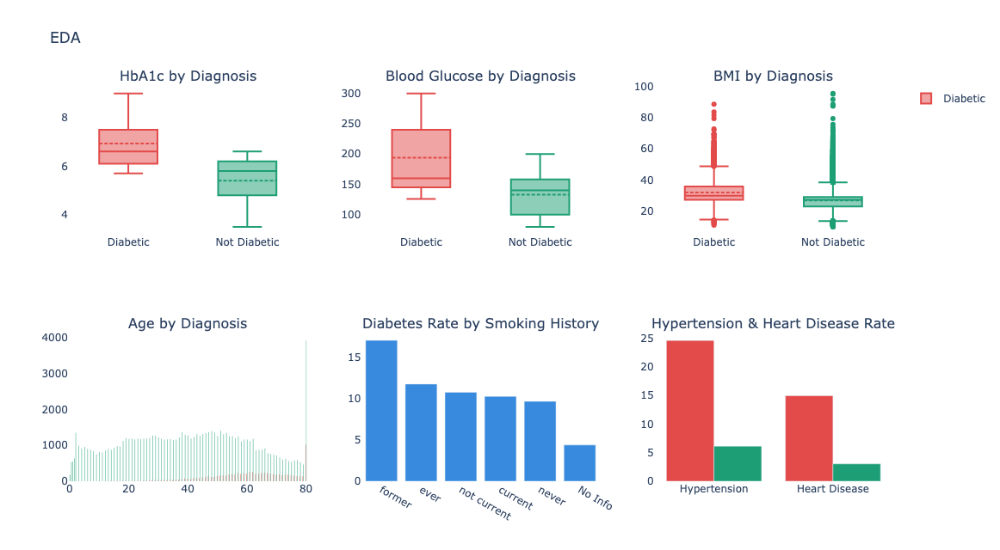
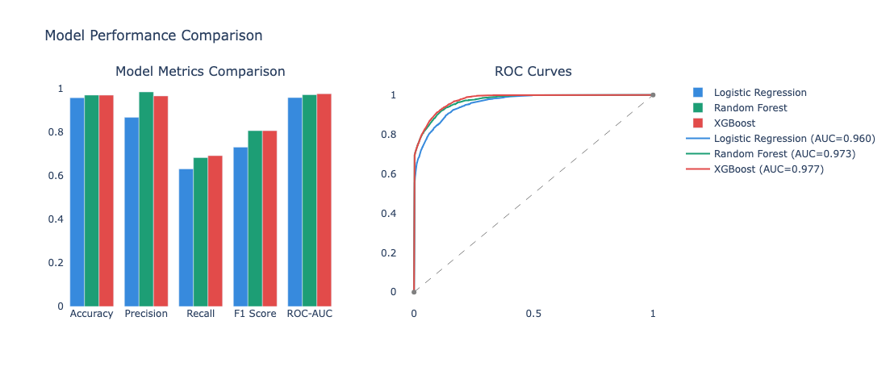
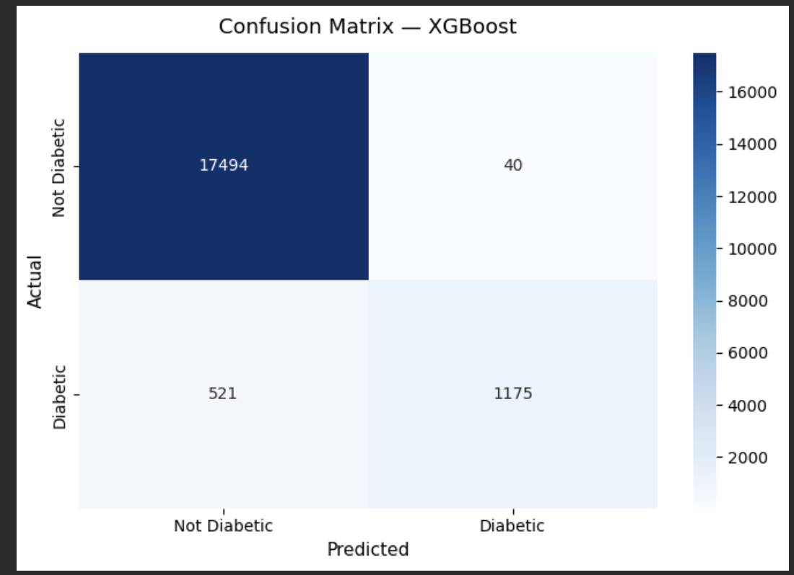
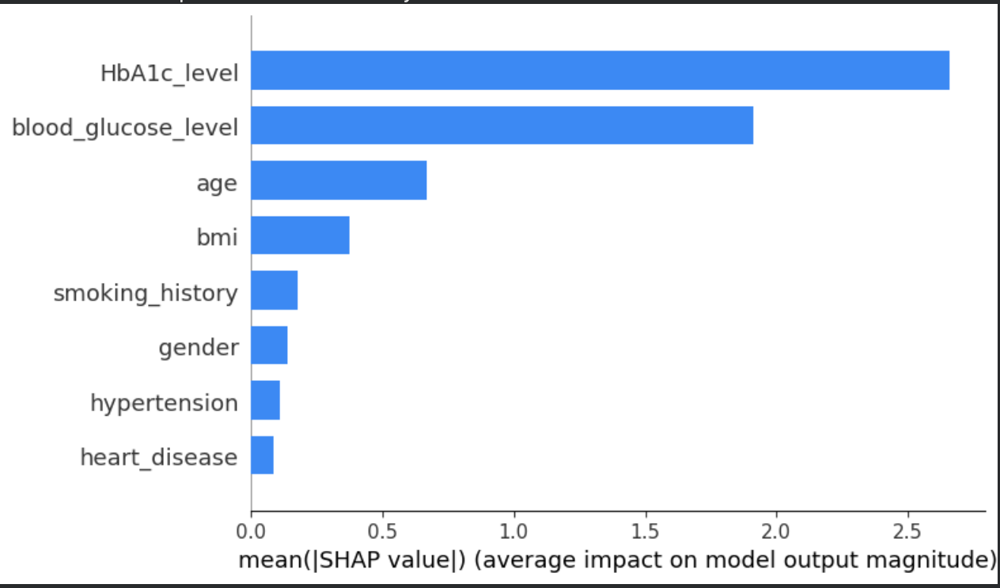
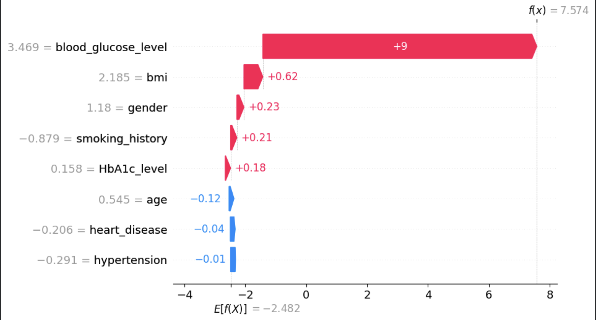
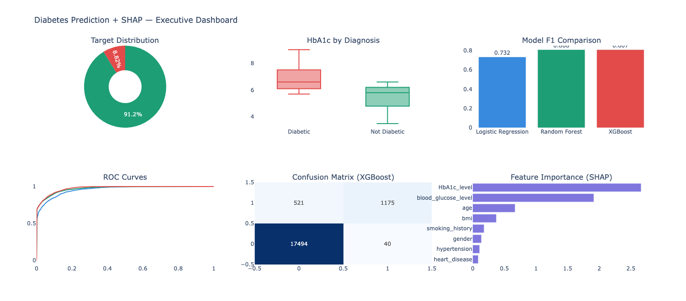

# 🩺 Diabetes Prediction with SHAP Explainability

> **Predicting diabetes risk from clinical data — and explaining every decision the model makes.**


---

## 📌 Project Overview

This project builds a machine learning pipeline to **predict whether a patient has diabetes** using 9 clinical features — and goes beyond accuracy by using **SHAP (SHapley Additive exPlanations)** to explain *why* the model made each prediction.

The key insight: a model that can't explain itself is a model you can't trust in healthcare.

---

## 📊 Dataset

**Source:** [Diabetes Prediction Dataset 2023 — Kaggle](https://www.kaggle.com/datasets/iammustafatz/diabetes-prediction-dataset)

| Property | Value |
|---|---|
| Records | 100,000 patients (96,146 after deduplication) |
| Features | 9 clinical variables |
| Target | Binary — `1` = Diabetic, `0` = Not Diabetic |
| Class balance | 91.2% healthy / 8.8% diabetic (10.3:1 ratio) |

### Feature Descriptions

| Feature | Type | Clinical Meaning |
|---|---|---|
| `gender` | Categorical | Male / Female / Other |
| `age` | Numeric | Patient age in years |
| `hypertension` | Binary | 1 = has hypertension |
| `heart_disease` | Binary | 1 = has heart disease |
| `smoking_history` | Categorical | never / current / former / ever / No Info |
| `bmi` | Numeric | Body mass index (kg/m²) |
| `HbA1c_level` | Numeric | Avg blood sugar over 3 months — **gold standard marker** |
| `blood_glucose_level` | Numeric | Fasting blood glucose (mg/dL) |
| `diabetes` | Binary | **Target variable** |

---

## 🔍 Exploratory Data Analysis



**Key findings:**
- **HbA1c** is the strongest separator — diabetic avg = 6.93 vs non-diabetic avg = 5.40
- **Blood glucose** gap of 62 mg/dL — clinically significant
- **Former smokers** show the highest diabetes rate — driven by age accumulation
- **Hypertension** present in ~24% of diabetic patients vs ~6% of healthy patients

---

## ⚙️ Methodology

### Pipeline
1. **EDA** — visualized feature distributions by diagnosis
2. **Preprocessing** — label encoding + StandardScaler (no data leakage)
3. **Modeling** — trained 3 models and compared them
4. **Evaluation** — F1, ROC-AUC, Recall (most critical for medical screening)
5. **SHAP** — explained predictions globally and per patient

### Models Trained

| Model | Description |
|---|---|
| Logistic Regression | Linear baseline |
| Random Forest | Ensemble of 200 decision trees |
| **XGBoost** ✅ | Gradient boosted trees — best performer |

---

## 📈 Results

### Model Comparison



| Model | Accuracy | Precision | Recall | F1 Score | ROC-AUC |
|---|---|---|---|---|---|
| Logistic Regression | 0.9591 | 0.8687 | 0.6321 | 0.7317 | 0.9596 |
| Random Forest | 0.9712 | **0.9856** | 0.6840 | 0.8075 | 0.9727 |
| **XGBoost** ✅ | 0.9708 | 0.9671 | **0.6928** | 0.8073 | **0.9771** |

### Confusion Matrix



| | Predicted: Healthy | Predicted: Diabetic |
|---|---|---|
| **Actual: Healthy** | 17,494 ✅ | 40 ❌ |
| **Actual: Diabetic** | 521 ❌ | 1,175 ✅ |

### 5-Fold Cross Validation

| Model | Mean F1 | Std Dev |
|---|---|---|
| Logistic Regression | 0.728 | ± 0.010 |
| Random Forest | 0.801 | ± 0.007 |
| **XGBoost** | **0.803** | **± 0.005** |

> XGBoost wins — highest AUC and lowest variance across all folds.

---

## 🔍 SHAP Explainability

### Global Feature Importance



### Individual Patient Explanation



**Top features by SHAP:**
1. 🥇 `HbA1c_level` — dominant predictor
2. 🥈 `blood_glucose_level` — strong second signal
3. 🥉 `age` — meaningful above 50
4. `bmi` — present but weaker than expected

---

## 📊 Executive Dashboard



---

## 🔧 How to Run

```bash
git clone https://github.com/hasan-ai05/diabetes-prediction-shap.git
cd diabetes-prediction-shap
pip install -r requirements.txt
jupyter notebook Diabetes_Prediction.ipynb
```

---

## 📦 Requirements

```
pandas
numpy
matplotlib
seaborn
plotly
scikit-learn
xgboost
shap
kagglehub
jupyter
```

---

## 💡 Key Takeaways

1. **HbA1c is king** — reflects 3 months of blood sugar history. SHAP confirmed it as the most influential feature
2. **ROC-AUC beats F1 for model selection** — evaluates all thresholds, not just one
3. **Recall matters most in healthcare** — missing a diabetic patient has real consequences
4. **SHAP makes models trustworthy** — bridges the gap between ML and clinical interpretability

---

## 👤 Author

**Hasan Akhras**
[LinkedIn](https://linkedin.com/in/YOUR_HANDLE) · [GitHub](https://github.com/hasan-ai05)

---

## 📄 License

This project is open source under the [MIT License](LICENSE).
